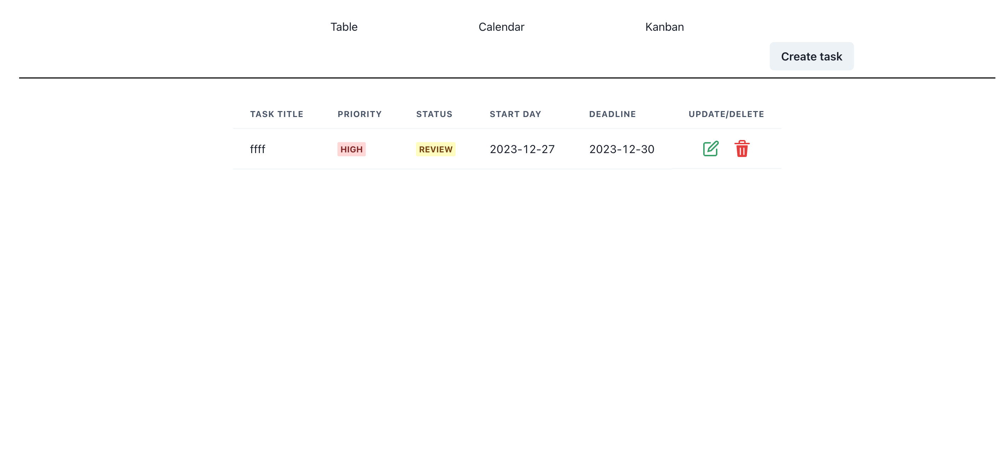

## Task Management Application
* No using db and backend API. tasks are stored in react state.
* 
#### https://task-management-gules-sigma.vercel.app/

## Directory structure
```
src
|-- components
|   |-- common
|   |   |-- TaskForm.tsx
|   |   |-- TaskItem.tsx
|   |   |-- PriorityBadge.tsx
|   |-- kanban
|   |   |-- KanbanBoard.tsx
|   |   |-- KanbanColumn.tsx
|   |-- calendar
|   |   |-- CalendarPage.tsx
|   |   |-- CalendarView.tsx
|   |-- table
|   |   |-- TableWrapper.tsx
|   |   |-- TaskTable.tsx
|   |-- App.tsx
|-- hooks
|   |-- useXXX.ts
|-- reducers
|   |-- xxxReducer.ts
|-- context
|   |-- xxxContext.ts
|-- router
|   |-- route.ts
|   |-- AppRouter.tsx
|-- styles
|   |-- // 
|-- index.tsx

```

